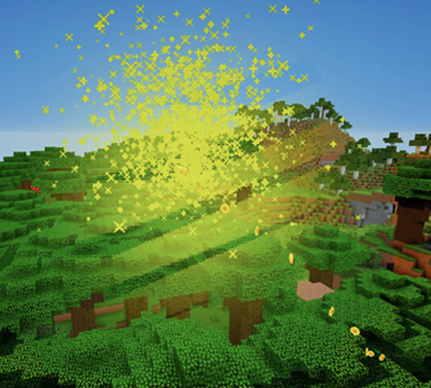
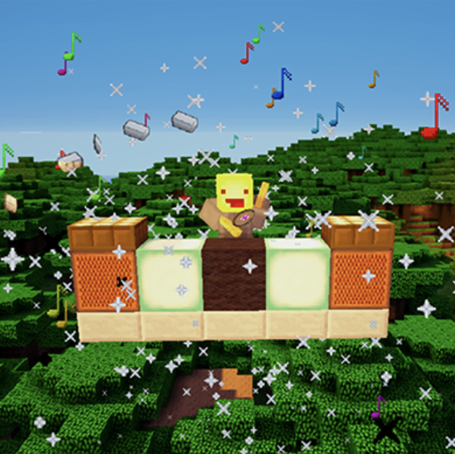
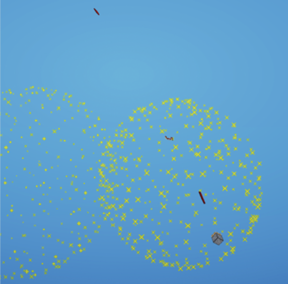
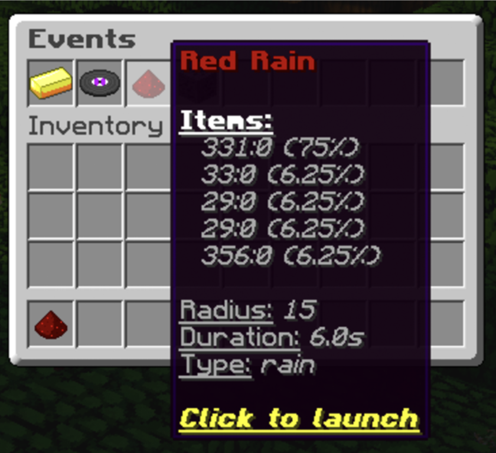
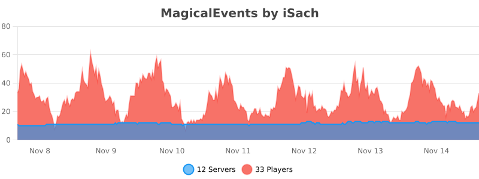

Magical Events lets you add fun animated events to your Minecraft server! Many servers use events to reward players with items, points or in-game money, which strongly attracts player engagement and activity. With Magical Events, you can make these events as fancy as you want, with cool visual and sound effects!

## Features

- Supports all Minecraft versions.
- Create as many events as you want
- 3 different base event animations
- Translatable
- Highly customizable
  - Each item and associated chance
  - Combine items and money with Vault support
  - Radius
  - Duration
  - Firework effects
- Support for NoteBlockAPI
- Intuitive GUI to start events
- Easy to use
- Fast and free support
- And more!

## Event types

#### Bomb

A static repeated firework explosion at a specific location that throws items around.

#### DJ

Spawns a DJ booth that plays music and shoots fireworks in the air while throwing items around.

#### Rain

This event makes firework explosions in the air at random locations from which items fall down.

#### Intuitive GUI

Events can be started through an intuitive GUI that reminds you the properties of each event.

## Documentation

For documentation, visit the Wiki. It provides detailed information on installation, configuration, and gameplay.

Wiki link: https://github.com/iSach/MagicalEventsWiki/wiki

## Support

I provide fast and free support to buyers through Discord. Please note that I prioritize bug fixes over new features which might require a lot of time.

Discord server link: https://discord.gg/YkdrhrUSAK

You can join also to ask pre-sale questions as well as try the plugin!

## Terms of service

The ToS were last changed on 14th November, 2025 at 6:00PM.

By purchasing Magical Events, you agree to the following terms of service:
- Magical Events is digital software. No refund can be guaranteed after purchase. Please contact me and try the plugin before buying it if you have doubts.
- No refunds includes no Paypal chargebacks, which induce further fees. If you really have an issue, please contact me first.
- The price might change at any time without notice.
- Rules might change. They only concern purchases made after the change.
- You are not allowed to decompile, share, or redistribute the plugin.

