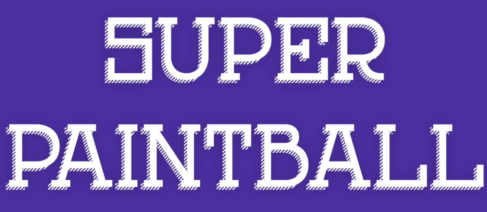

**Attention, this plugin is for standalone or servers that are part of a network only. The game occupies the whole server.**

Super Paintball is a very well-known arcade game. Two teams fight each other to eliminate the whole enemy team. Players have to paint enemies to eliminate them. You can also revive your dead teammates or heal yourself using Water Bombs.

# Features

- Bungee-only! (or servers dedicated to the game)
- Supports all Minecraft versions
- Three fun kits
- Achievements
- Translatable
- Game statistics
- Lightweight
- Easy to set up
- MySQL support
- Vault support
- Hightly configurable
- Fast and free support
- and more!

## Videos

Here are two videos showing how to set up the plugin.

<iframe width="420" height="280"
        src="https://www.youtube.com/embed/zOUgJrCgFmE"
        frameborder="0"
        allowfullscreen>
</iframe>

<iframe width="420" height="280"
        src="https://www.youtube.com/embed/6F7xZ5TZk0Q"
        frameborder="0"
        allowfullscreen>
</iframe>

## Documentation

For documentation, visit the Wiki. It provides detailed information on installation, configuration, and gameplay.

Wiki link: https://github.com/iSach/SuperPaintballWiki/wiki

## Support

I provide fast and free support to buyers through Discord. Please note that I prioritize bug fixes over new features which might require a lot of time. I can set up the plugin for you if needed.

Discord server link: https://discord.gg/YkdrhrUSAK

You can join also to ask pre-sale questions as well as try the plugin!

## Terms of service

The ToS were last changed on 14th November, 2025 at 6:00PM.

By purchasing Super Paintball, you agree to the following terms of service:
- Super Paintball is digital software. No refund can be guaranteed after purchase. Please contact me and try the plugin before buying it if you have doubts.
- No refunds includes no Paypal chargebacks, which induce further fees. If you really have an issue, please contact me first.
- The price might change at any time without notice.
- Rules might change. They only concern purchases made after the change.
- You are not allowed to decompile, share, or redistribute the plugin.