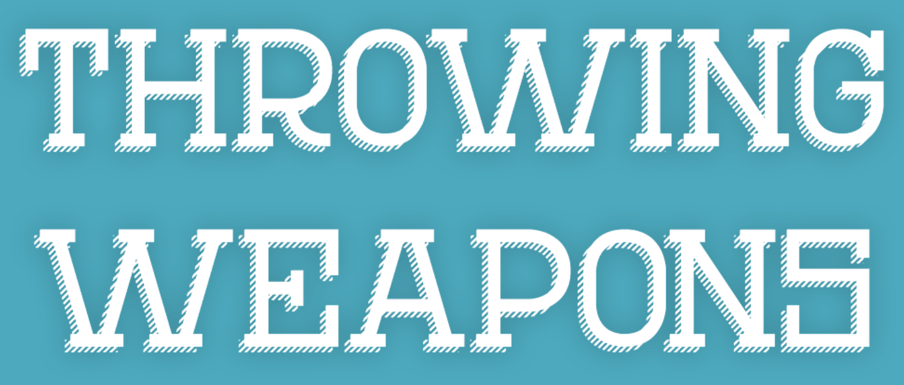
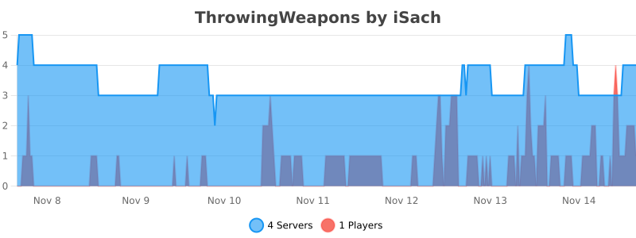

Throwing weapons adds animated throwable weapons to your server! The plugin is very extensible and customizable: You can create infinitely many different throwing weapons with custom 3D models, sounds, trails, commands that execute when killing or hitting, and much more.

## Features

- Supports all Minecraft versions.
- Supports custom 3D models (Minecraft/Oraxen/ItemsAdder/Nexo)
- Very customizable:
  - Display name, lore
  - Damage, per-weapon or global cooldown
  - Permission
  - Particle trail
  - Durability
  - Custom crafting recipe
  - Commands when hitting or killing players or entities.
  - Custom drop chance
  - Automatically going back to inventory
  - Custom sounds
  - Throwing action (left click, right click, drop)
  - Weapon modifiers
  - Knockback
  - Straight trajectory or custom gravity

Check out the default config here: https://pastebin.com/aYCbPpLr

## Video

This video shows the animation of the weapons. Feel free to join the Discord server to ask for trying the plugin.

<iframe width="420" height="280"
        src="https://www.youtube.com/embed/aDI8ohetV8M"
        frameborder="0"
        allowfullscreen>
</iframe>

## Documentation

For documentation, visit the Wiki. It provides detailed information on installation, configuration, and gameplay.

Wiki link: https://github.com/iSach/ThrowingWeaponsWiki/wiki

## Support

I provide fast and free support to buyers through Discord. Please note that I prioritize bug fixes over new features which might require a lot of time. I can also help you set up the plugin on your server.

Discord server link: https://discord.gg/YkdrhrUSAK

You can join also to ask pre-sale questions as well as try the plugin!

## Terms of service

The ToS were last changed on 14th November, 2025 at 6:00PM.

By purchasing Throwing Weapons, you agree to the following terms of service:
- Throwing Weapons is digital software. No refund can be guaranteed after purchase. Please contact me and try the plugin before buying it if you have doubts.
- No refunds includes no Paypal chargebacks, which induce further fees. If you really have an issue, please contact me first.
- The price might change at any time without notice.
- Rules might change. They only concern purchases made after the change.
- You are not allowed to decompile, share, or redistribute the plugin.

