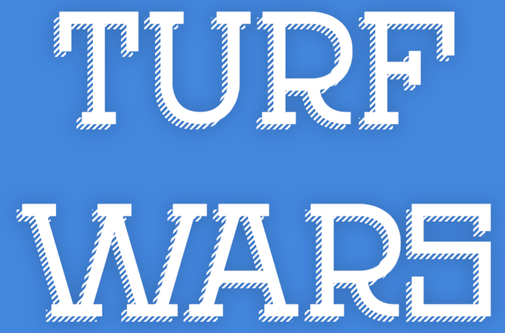

Turf Wars is a legendary arcade game you might know well already. Two teams, blue and red,fight each other to make the opposite team lose all its territory. Each territory consists of some number of lines. Both teams start with the same turf, and the one without any turf left loses the game..

During the build time, players can build defenses and can't attack. But when combat time begins, players can still build, but won't be safe as everybody can attack with their weapons!

## Features

- Supports all Minecraft versions
- Supports very different kinds of maps, 2D and 3D.
- Four different yet customizable kits
- Configurable scoreboard
- Map rotation system
- Every message can be translated
- Bungee mode or not (**max 1 game/server!!**)
- Restart system (useful for low-RAM servers/networks)
- Runs lightweight on your server
- Customizable reward system
- MySQL support
- Vault/PlayerPoints/... support
- Highly configurable
- Spectator mode
- Achievements
- Fast support through Discord (only fixes now)
- And more...

## Kits

The plugin contains four kits for which you can customize the price and access.

#### Marksman
-   Default kit
-   Bow and arrows

#### Infiltrator
-   Bow and arrows
-   Can go in enemy turf during attack time

#### Shredder
-   Bow and arrows
-   Shoots more but weaker arrows at a time

#### Ninja
-   Bow and arrows
-   Speed and jump boost
-   Achievement kit

## Documentation

Permissions are available here: https://pastebin.com/xQxWwPF7

For all other documentation, visit the Wiki. It provides detailed information on installation, configuration, and gameplay.

Wiki link: https://turfwars.isach.be/

## Video

The following video shows how to set up a map.

<iframe width="420" height="280"
        src="https://www.youtube.com/embed/yxGtWUqbU-4"
        frameborder="0"
        allowfullscreen>
</iframe>

## Support

I provide fast and free support to buyers through Discord. Please note that I prioritize bug fixes over new features which might require a lot of time.

Discord server link: https://discord.gg/YkdrhrUSAK

You can join also to ask pre-sale questions as well as try the plugin!

## Terms of service

The ToS were last changed on 14th November, 2025 at 6:00PM.

By purchasing Turf Wars, you agree to the following terms of service:
- Turf Wars is digital software. No refund can be guaranteed after purchase. Please contact me and try the plugin before buying it if you have doubts.
- No refunds includes no Paypal chargebacks, which induce further fees. If you really have an issue, please contact me first.
- The price might change at any time without notice.
- Rules might change. They only concern purchases made after the change.
- You are not allowed to decompile, share, or redistribute the plugin.

